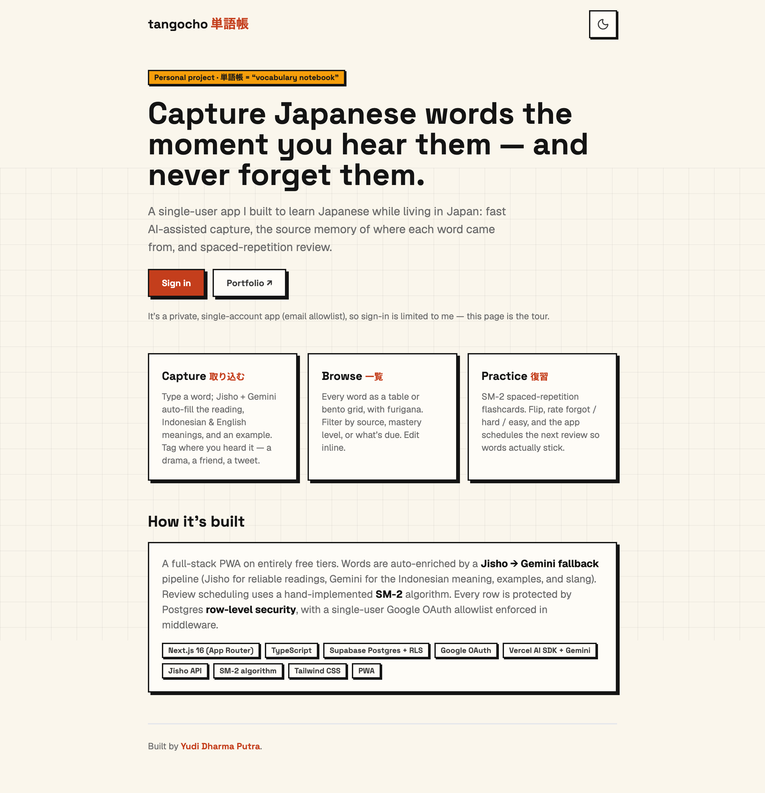

# tangocho 単語帳

A personal Japanese vocabulary notebook — capture words with AI auto-fill, remember **where** you learned them, and review them with spaced repetition.

**Live:** [tangocho.yudidputra.com](https://tangocho.yudidputra.com) · single-user (email allowlist), so the public [`/about`](https://tangocho.yudidputra.com/about) page is the tour.



---

## Why

I'm an Indonesian developer living in Japan. I pick up new words every day — from friends, dramas, anime, signs, social media — and forget them almost immediately. Notes apps get messy and I lose track of where a word came from.

tangocho is built around three ideas:

- **Capture** — type a word; it auto-fills the reading (furigana), **Indonesian** + **English** meanings, and an example sentence, so adding a word takes seconds. Tag the source — _"Midnight Diner S2 Ep.3"_, _"Sato-san at work"_, _"Twitter"_ — because the memory of where you heard it is half of remembering it.
- **Browse** — every word as a table or bento grid, with furigana, filterable by source, mastery, or what's due.
- **Practice** — SM-2 spaced-repetition flashcards so saved words actually stick.

## Features

- 🤖 **AI auto-fill** — Jisho (reliable readings / English / JLPT) with a Gemini fallback for slang and the Indonesian meaning + examples
- 🏷️ **Structured sources** — type + name + detail, with autocomplete of past sources
- 🔁 **SM-2 spaced repetition** — flip cards, rate _forgot / hard / easy_, auto-scheduled reviews + due badge
- 📊 **Progress** — mastery distribution, review streak, last-14-days activity
- 📱 **PWA** — installable, offline shell, home-screen icon (守)
- 🔒 **Private** — Google OAuth + single-email allowlist, Postgres row-level security on every table

## Tech & architecture

| | |
|---|---|
| **Framework** | Next.js 16 (App Router, RSC, Server Actions), React 19, TypeScript |
| **Styling** | Tailwind CSS — custom retro/brutalist design system (hard offset shadows, no UI library) |
| **Data & auth** | Supabase Postgres + Google OAuth via `@supabase/ssr`; RLS (`user_id = auth.uid()`) on every table |
| **AI** | Vercel AI SDK v6 + `@ai-sdk/google` (`gemini-2.5-flash`), structured output via `generateObject` + Zod |
| **Dictionary** | Jisho public API (primary) → Gemini (fallback / Indonesian + examples) |
| **Hosting** | Vercel + Supabase, entirely on free tiers |
| **Tests** | Vitest (SM-2 engine) |

A few details worth highlighting:

- **Enrichment pipeline** (`app/api/enrich`, `lib/jisho.ts`, `lib/enrich/schema.ts`) — Jisho is queried first for accurate readings/POS/JLPT; Gemini always supplies the Indonesian meaning + example and fully fills slang words Jisho doesn't know. Input is debounced (`useDebounce`) with an IME-composition guard so keystrokes don't burn API calls.
- **Auth & isolation** — a single `ALLOWED_EMAIL` is enforced in proxy middleware; non-allowlisted Google accounts get a friendly "not you" screen. RLS means even a leaked anon key exposes nothing.
- **SM-2** (`lib/srs.ts`) — a pure, unit-tested 3-button variant (forgot→q2, hard→q3, easy→q5) computing ease factor, interval, and next due date.

## Project structure

```
app/
  (app)/            # authenticated shell: dashboard, capture, browse, practice, progress
  about/            # public landing (portfolio showcase)
  login/ denied/    # auth screens
  auth/callback/    # OAuth code exchange + allowlist enforcement
  api/enrich/       # Jisho + Gemini enrichment
components/         # ui primitives (Card/Button/Badge), SourceField, flashcards…
lib/                # supabase clients, srs, jisho, mastery, hooks
supabase/migrations # schema + RLS
proxy.ts            # session refresh + route protection + allowlist
```

## Local development

```bash
npm install
cp .env.local.example .env.local   # fill in the values below
npm run dev                         # http://localhost:3000
```

Environment variables:

```
NEXT_PUBLIC_SUPABASE_URL=
NEXT_PUBLIC_SUPABASE_ANON_KEY=
ALLOWED_EMAIL=
GOOGLE_GENERATIVE_AI_API_KEY=       # free key from aistudio.google.com/apikey
```

Commands:

```bash
npm run dev     # dev server (Turbopack)
npm run build   # production build
npm run lint    # ESLint
npm test        # vitest (SM-2 unit tests)
```

Database migrations live in `supabase/migrations/` (`supabase db push` to apply).

---

Built by [Yudi Dharma Putra](https://yudidputra.com). Personal, non-commercial.
