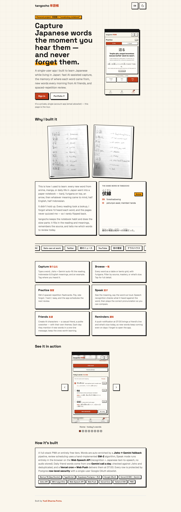

# tangocho 単語帳

A personal Japanese vocabulary notebook — capture words with AI auto-fill, remember **where** you learned them, get new words every morning from AI "friends", and review them with spaced repetition.

**Live:** [tangocho.yudidputra.com](https://tangocho.yudidputra.com) · single-user (email allowlist), so the public [`/about`](https://tangocho.yudidputra.com/about) page is the tour.



---

## Why

I'm an Indonesian developer living in Japan. I pick up new words every day — from friends, dramas, anime, signs, social media — and forget them almost immediately. I used to write them in a paper notebook (kanji, furigana, an arrow, a meaning), but every reading took a lookup, I forgot where I'd heard each word, and the pages never quizzed me.

tangocho is built around five ideas:

- **Capture** — type a word; it auto-fills the reading (furigana), **Indonesian** + **English** meanings, and an example sentence, so adding a word takes seconds. Tag the source — _"Midnight Diner S2 Ep.3"_, _"Sato-san at work"_, _"Twitter"_ — because the memory of where you heard it is half of remembering it.
- **Browse** — every word as a table or bento grid, with furigana, filterable by source, mastery, or what's due.
- **Practice** — SM-2 spaced-repetition flashcards so saved words actually stick.
- **Speak** — see the meaning, say the word out loud. Reading a word isn't the same as being able to say it.
- **Friends** — on days I don't add anything, AI characters I define (a casual friend, a polite coworker) each mention a word in a one-line message; I keep the ones worth learning.

## Features

- 🤖 **AI auto-fill** — Jisho (reliable readings / English / JLPT) with a Gemini fallback for slang and the Indonesian meaning + examples
- 🏷️ **Structured sources** — type + name + detail, with autocomplete of past sources
- 🔁 **SM-2 spaced repetition** — flip cards, rate _forgot / hard / easy_, auto-scheduled reviews + due badge
- 🎙️ **Speak mode** — say the word from its meaning; speech recognition checks it, then the app plays the correct pronunciation (in-browser, free, no audio stored)
- 🔊 **Pronunciation audio** — play any word in Practice or Browse
- 💬 **AI friends** — characters with a relationship (friend = casual タメ口, coworker = polite/business), themes and a persona; 4 words a day on Home, each inside the friend's line, Jisho-checked and never repeated. Save, mark _known_, or skip — reactions steer the next day's picks
- 🔔 **Daily push** — 07:00 JST web push with a friend's line and what's due (iOS home-screen app included)
- 📊 **Progress** — mastery distribution, review streak, last-14-days activity, friend-word save rate
- 📱 **PWA** — installable, offline shell, home-screen icon (守)
- 🔒 **Private** — Google OAuth + single-email allowlist, Postgres row-level security on every table

## Tech & architecture

| | |
|---|---|
| **Framework** | Next.js 16 (App Router, RSC, Server Actions), React 19, TypeScript |
| **Styling** | Tailwind CSS — custom retro/brutalist design system (hard offset shadows, no UI library) |
| **Data & auth** | Supabase Postgres + Google OAuth via `@supabase/ssr`; RLS (`user_id = auth.uid()`) on every table |
| **AI** | Vercel AI SDK v6 + `@ai-sdk/google` (`gemini-2.5-flash`), structured output via `generateObject` + Zod |
| **Dictionary** | Jisho public API (primary) → Gemini (fallback / Indonesian + examples) |
| **Speech** | Web Speech API — `SpeechRecognition` (`ja-JP`) + `speechSynthesis`, no server or quota |
| **Push & jobs** | Web Push (`web-push`, VAPID) + a daily Vercel Cron |
| **Hosting** | Vercel + Supabase, entirely on free tiers |
| **Tests** | Vitest (SM-2 engine, Jisho matching, speech matching, progress stats, daily-word filtering, push payload) |

A few details worth highlighting:

- **Enrichment pipeline** (`app/api/enrich`, `lib/jisho.ts`, `lib/enrich/schema.ts`) — Jisho is queried first for accurate readings/POS/JLPT; Gemini always supplies the Indonesian meaning + example and fully fills slang words Jisho doesn't know. Input is debounced (`useDebounce`) with an IME-composition guard so keystrokes don't burn API calls.
- **Auth & isolation** — a single `ALLOWED_EMAIL` is enforced in proxy middleware; non-allowlisted Google accounts get a friendly "not you" screen. RLS means even a leaked anon key exposes nothing.
- **SM-2** (`lib/srs.ts`) — a pure, unit-tested 3-button variant (forgot→q2, hard→q3, easy→q5) computing ease factor, interval, and next due date.
- **Speak mode** (`lib/speech.ts`, `components/practice/useSpeechRecognition.ts`) — recognition alternatives are matched against the term *or* its reading (katakana folded to hiragana). A match only suggests the rating; you still rate, so a mishearing never corrupts the schedule. Interim results are kept and flushed on stop, because macOS Safari never finalizes on its own.
- **Daily friend words** (`lib/daily.ts`) — one `generateObject` call a day returns every field (reading, meanings, the friend's line with furigana, translations), so saving costs no further AI requests on Gemini's free tier. Difficulty follows the relationship: JLPT only covers textbook Japanese, so coworkers aim at N2–N1/business vocabulary while friends pick slang textbooks skip. Each word is checked against Jisho (whose reading/POS win, but not its literal meaning for slang — 草 stays "lol", not "grass") and deduplicated against everything ever saved or suggested.
- **Push & cron** (`app/api/cron/daily`, `lib/push.ts`, `public/sw.js`) — at 07:00 JST a `CRON_SECRET`-guarded route pre-generates the day's words and sends one web push. It runs without a user session, so it uses a server-only service-role client and every query filters by `user_id` explicitly.

## Project structure

```
app/
  (app)/            # authenticated shell: home, capture, browse, practice, progress, friends
  about/            # public landing (portfolio showcase)
  login/ denied/    # auth screens
  auth/callback/    # OAuth code exchange + allowlist enforcement
  api/enrich/       # Jisho + Gemini enrichment
  api/cron/daily/   # 07:00 JST: pre-generate friend words + web push
components/         # ui primitives (Card/Button/Badge), SourceField, flashcards, friends, home…
lib/                # supabase clients, srs, speech, jisho, mastery, daily words, push, hooks
supabase/migrations # schema + RLS
proxy.ts            # session refresh + route protection + allowlist
```

## Local development

```bash
npm install
cp .env.local.example .env.local   # fill in the values below
npm run dev                         # http://localhost:3000
```

Environment variables:

```
NEXT_PUBLIC_SUPABASE_URL=
NEXT_PUBLIC_SUPABASE_ANON_KEY=
SUPABASE_SECRET_KEY=                # service role, server-only — used by the daily cron
ALLOWED_EMAIL=
GOOGLE_GENERATIVE_AI_API_KEY=       # free key from aistudio.google.com/apikey
NEXT_PUBLIC_VAPID_PUBLIC_KEY=       # npx web-push generate-vapid-keys
VAPID_PRIVATE_KEY=
CRON_SECRET=                        # openssl rand -hex 32; Vercel sends it to the cron
```

Commands:

```bash
npm run dev     # dev server (Turbopack)
npm run build   # production build
npm run lint    # ESLint
npm test        # vitest unit tests
```

Database migrations live in `supabase/migrations/` (`supabase db push` to apply).

---

Built by [Yudi Dharma Putra](https://yudidputra.com). Personal, non-commercial.
